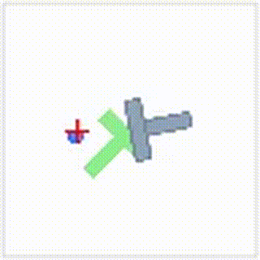

## Installation

Follow [HW.md](./HW.md) and `pip install moviepy`

## Usage
- Training
```bash
bash scripts/train_policy.sh {diff_pusht, reg_pusht, diff_calvin}
```

- Evaluation follows [HW.md](./HW.md)


## Push-T Benchmark

### Success rates

|          | train | test  |
|----------|-------|-------|
| diffusion| 0.996 | 0.822 |
| regression| 0.846 | 0.823 |

### Evaluation rollout videos

#### diffusion
<table>
	<tr>
		<th>100000</th>
		<th>100001</th>
		<th>100002</th>
		<th>100003</th>
	</tr>
	<tr>
		<td>
			<a href="./demo/diff_pusht_eval_output/media/seed100000.mp4">
			
			</a>
		</td>
		<td>
			<a href="./demo/diff_pusht_eval_output/media/seed100001.mp4">
			
			</a>
		</td>
		<td>
			<a href="./demo/diff_pusht_eval_output/media/seed100002.mp4">
			
			</a>
		</td>
		<td>
			<a href="./demo/diff_pusht_eval_output/media/seed100003.mp4">
			
			</a>
		</td>
	</tr>
</table>


#### regression

<table>
	<tr>
		<th>100000</th>
		<th>100001</th>
		<th>100002</th>
		<th>100003</th>
	</tr>
	<tr>
		<td>
			<a href="./demo/reg_pusht_eval_output/media/seed100000.mp4">
			
			</a>
		</td>
		<td>
			<a href="./demo/reg_pusht_eval_output/media/seed100001.mp4">
			</a>
		</td>
		<td>
			<a href="./demo/reg_pusht_eval_output/media/seed100002.mp4">
			</a>
		</td>
		<td>
			<a href="./demo/reg_pusht_eval_output/media/seed100003.mp4">
			</a>
		</td>
	</tr>
</table>

### Sampled trajectories (seed10001.mp4)
#### diffusion
<table>
	<tr>
		<th>seed=8</th>
		<th>seed=16</th>
	</tr>
	<tr>
		<td>
			<a href="./demo/diff_pusht_eval_output_8/media/seed100001.mp4">
			</a>
		</td>
		<td>
			<a href="./demo/diff_pusht_eval_output_16/media/seed100001.mp4">
			</a>
		</td>
	</tr>
</table>

#### regression (no difference)
<table>
	<tr>
		<th>seed=8</th>
		<th>seed=16</th>
	</tr>
	<tr>
		<td>
			<a href="./demo/reg_pusht_eval_output_8/media/seed100001.mp4">
			</a>
		</td>
		<td>
			<a href="./demo/reg_pusht_eval_output_16/media/seed100001.mp4">
			</a>
		</td>
	</tr>
</table>

## CALVIN Benchmark

### Success rates 
```
1/5 : 55.0% | 2/5 : 0.0% | 3/5 : 0.0% | 4/5 : 0.0% | 5/5 : 0.0% ||
```

### Evaluation rollout videos 
<table>
	<tr>
		<th>open succeed</th>
		<th>open failed</th>
		<th>close succeed 1</th>
		<th>close succeed 2</th>
	</tr>
	<tr>
		<td>
			<a href="./demo/calvin_eval_30000/calvin_seq7.mp4">
			</a>
		</td>
		<td>
			<a href="./demo/calvin_eval_30000/calvin_seq8.mp4">
			</a>
		</td>
		<td>
			<a href="./demo/calvin_eval_30000/calvin_seq30.mp4">
			</a>
		</td>
		<td>
			<a href="./demo/calvin_eval_30000/calvin_seq70.mp4">
			</a>
		</td>
	</tr>
</table>


## Youtube DEMO
[https://youtu.be/dq_oauqjtqg](https://youtu.be/dq_oauqjtqg)
